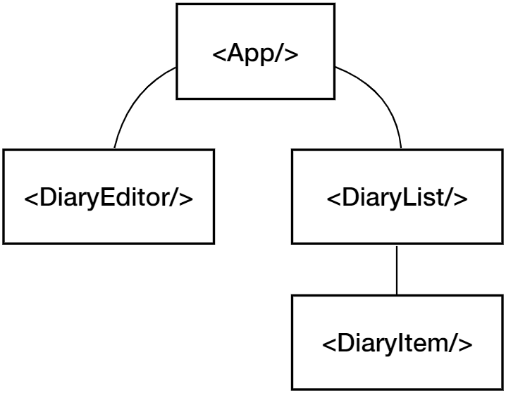
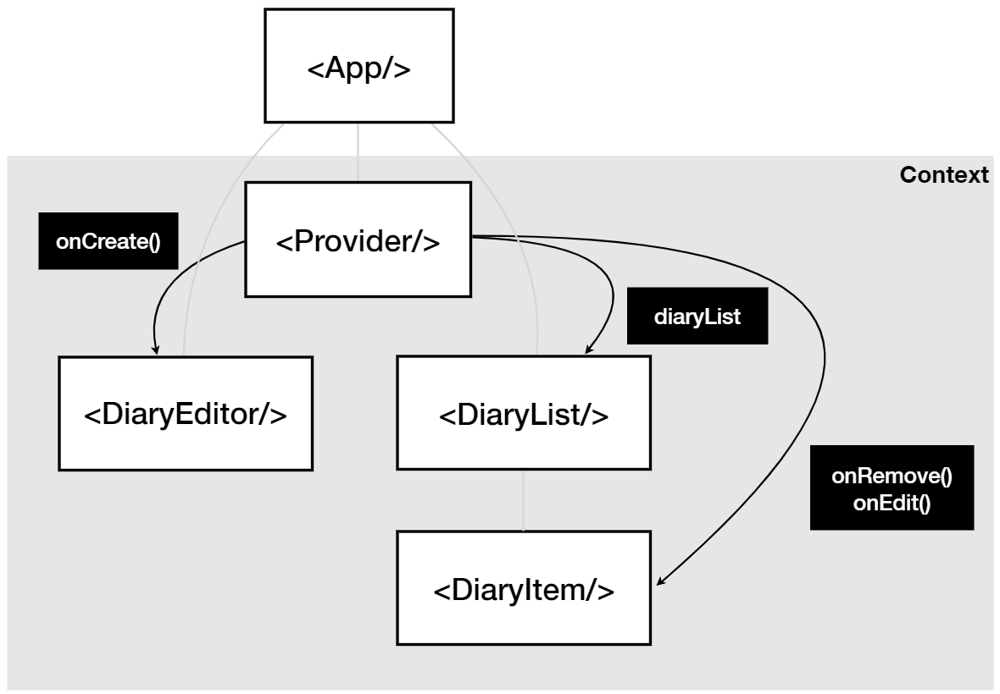

# 감정 일기장

## 🔗 배포 링크

https://hakjunkim-react-proejct.web.app/

## 📓 소개

- 일기를 작성하는 서비스
- 감정까지 함께 기록 가능

## 🔨 과정

1. 기본 세팅

- 폰트, 레이아웃, 이미지 asset 세팅
- 공통 컴포넌트 세팅 예) 버튼, 헤더

2. 구조

   

3. 각 페이지 구현

## 🔍 구현 설명

- 입력값 받기

  ```javascript
  const [state, setState] = useState({
    author: "작가",
    content: "본문",
    emotion: 1,
  });

  const handleChangeState = (e) => {
    setState({
      ...state,
      [e.target.name]: e.target.value,
    });
  };

  <textarea
    ref={contentInput}
    name="content"
    value={state.content}
    onChange={handleChangeState}
  />;
  ```

  - 각각의 입력값을 받는 태그의 속성 onChange 값으로 handleChangeState로 지정
  - `handleChange`는 `state`를 지정

- 일기 통계

  ```javascript
  const getDiaryAnalysis = useMemo(() => {
    const goodCount = data.filter((item) => item.emotion >= 3).length;
    const badCount = data.length - goodCount;
    const goodRatio = (goodCount / data.length) * 100;

    return { goodCount, badCount, goodRatio };
  }, [data.length]);

  const { goodCount, badCount, goodRatio } = getDiaryAnalysis;
  ```

  - `useMemo()`: memoization을 통한 연산 과정 최적화
    - 첫번째 인자: 콜백함수의 리턴 값은 getDiaryAnalysis로 저장됨
    - 두번째 인자: 배열의 값, data.length의 값이 바뀌면 콜백함수를 다시 실행

- 일기 내용은 5자 이상

  ```javascript
  const localContentInput = useRef();

  const handleEdit = () => {
    if (localContent.length < 5) {
      localContentInput.current.focus();
      return;
    }

    if (window.confirm(`${id}번 째 일기를 수정하시겠습니까?`)) {
      onEdit(id, localContent);
      toggleIsEdit();
    }

    <textarea
      ref={localContentInput}
      value={localContent}
      onChange={(e) => setLocalContent(e.target.value)}
    />;
  };
  ```

  - `useRef()`: DOM에서 어떤 요소를 선택하고 있는지 알게 함
  - `focus()`를 통해 조건을 만족하지 않을 경우 참조하는 요소로 커서를 이동

- `Context API`를 통한 데이터 전역 공급

  - `Context` 생성

    ```javascript
    export const DiaryStateContext = React.createContext();
    ```

  - `Context Provider`를 통한 데이터 공급

    

    ```javascript
    const onCreate = (author, content, emotion) => {
      const created_time = new Date().getTime();
      const newItem = {
        id: dataId.current,
        author,
        content,
        emotion,
        created_time,
      };

      dataId.current += 1;
      setData([newItem, ...data]);
    };

    const provider = { data, onCreate };

    <DiaryStateContext.Provider value={provider}>
      <DiaryEditor />
      <div>전체 일기: {data.length}</div>
      <div>기분 좋은 일기 개수: {goodCount}</div>
      <div>기분 나쁜 일기 개수: {badCount}</div>
      <div>기분 좋은 일기 비율: {goodRatio}</div>
      <DiaryList onEdit={onEdit} onDelete={onDelete} />
    </DiaryStateContext.Provider>;
    ```

- 리스트 렌더링

  ```javascript
  const { data: diaryList } = useContext(DiaryStateContext);

  diaryList.map((item) => {
    return (
      <DiaryItem key={item.id} {...item} onEdit={onEdit} onDelete={onDelete} />
    );
  });
  ```

  - map을 통해 각 리스트의 값을 `DiaryItem` 컴포넌트로 전달

## 🎯 개선할 점

- session의 key-value 값을 이용하고 있음

  ⇨ 데이터를 저장, 분석 등을 목적으로 데이터베이스와의 연결 필요

- React hook을 이용한 최적화

## ⚛️ React 토막 정리

### _React_ 도입 이유

- *React*는 자바스크립트 라이브러리

- 원래 자바스크립트는 브라우저 위에서만 돌아갈 수 있음 ⮕ Node.js를 사용해 자바스크립트를 아무 곳에서나 실행시키기 위해 탄생한 것이 _React_

### *React*의 필요성

- 유지 보수의 용이: 중복되는 부분을 컴포넌트로 대체

- 명령형 프로그래밍의 단점을 개선한 선언형 프로그래밍

  - 예) 선언형 프로그래밍 방법을 사용해 `result`라는 요소안의 `innerText`를 바꾸는 경우

  1. `getElementById` – `id`가 `result`인 것을 갖고 옴
  2. `result.innerText` – 그 안의 텍스트 0을 갖고 옴
  3. `result.innerHtml` – 그 안의 텍스트를 대치

  ⇨ 너무 길어짐

- 가상 DOM 사용: 브라우저 DOM과는 달리 업데이트를 할 수 있는 부분을 가상 DOM에 모아 한번에 브라우저 DOM에 업데이트

  ⇨ 효율적

### `Promise` 객체

- 도입 이유

  - 비동기 작업의 장점: 하나의 작업이 끝날 동안 다른 작업은 모두 대기 상태를 유지하는 동기 작업의 단점을 극복하기 위함

  - 비동기 작업으로 구현했을 때 각 작업들이 정상적으로 끝났음을 확인하는 방법

    ⇨ 콜백 함수

  - _그러나_ 콜백 함수의 문제점: 콜백함수에 콜백함수를 넣어 비동기 처리의 값을 다른 비동기 처리의 매개 변수로 전달 가능

    ⇨ 콜백 지옥

- 특징

  - `resolve` (성공), `reject` (실패) 경우로 구분 ⮕ 결과는 `Promise` 객체 ⮕ `then` 또는 `catch`로 사용 가능

  - **어떤 함수가 Promise 객체를 반환한다는 것**

    ```
    그 함수는 비동기적으로 동작 하고, 반환된 Promise 객체를 통해 비동기 처리 값을 `then`과 `catch`로 이용할 수 있게 하겠다는 것

    예) `fetch`의 리턴 값은 `Promise` 객체 타입 ⮕ `fetch`는 비동기처리를 하는 함수 ⮕ 이 함수의 처리결과는 `then`을 통해서 사용할 수 있음
    ```

### _React_ Hook

- `useState`: 상태의 값, 상태를 변화하는 함수를 리턴하는 메서드

  ```javascript
  const [상태의 값, 상태를 변화하는 함수] = useState(초기 상태 값);
  ```

### `Props`: 컴포넌트에 데이터를 전달하는 방법

- 전달하는 쪽: `spread` 연산자 사용
- 받는 쪽: 비구조화 할당 사용

  - 배열, 객체 속성을 해체 후 개별 변수에 값을 담음

- **[주의]** 부모로부터 `props`를 받지 않더라도, 부모의 `state`가 바뀌면 `re-render`를 하게 됨
